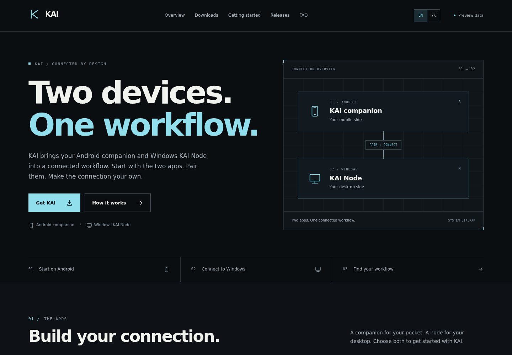
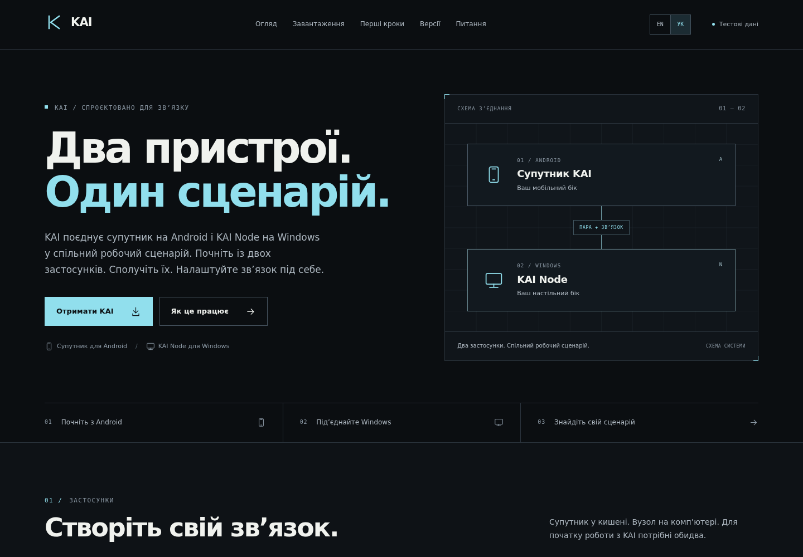
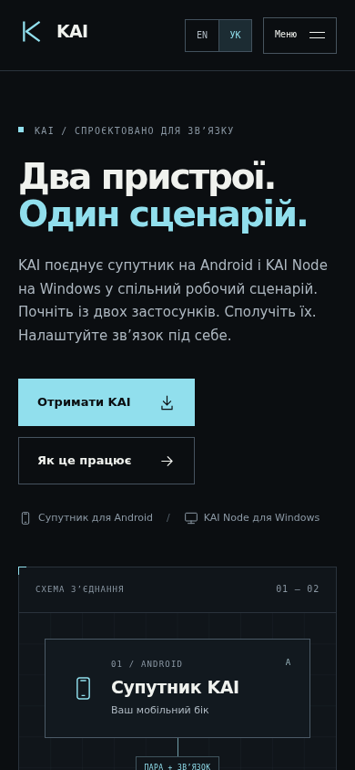
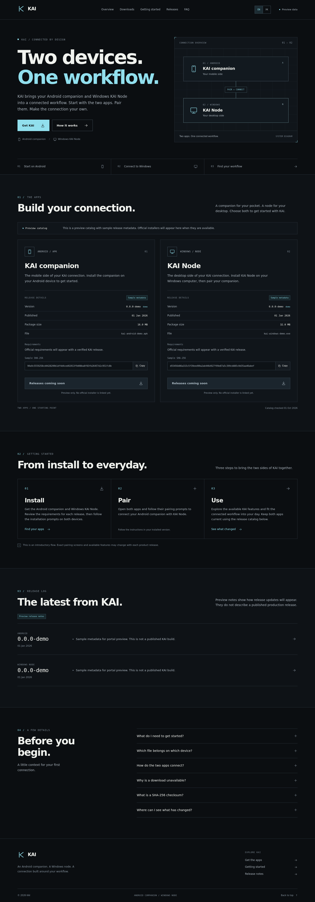
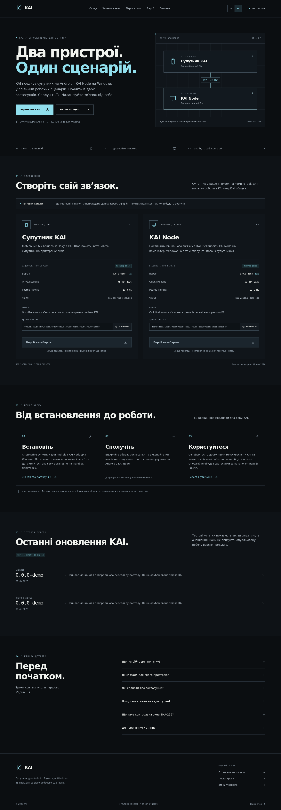
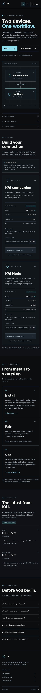
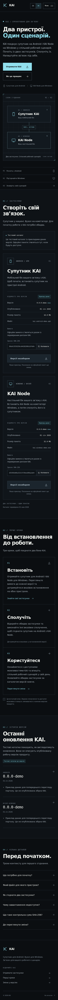
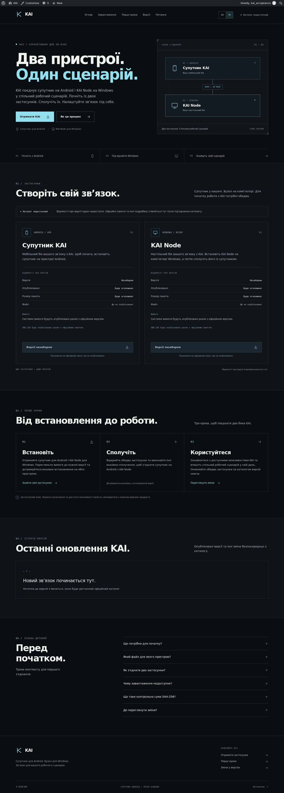
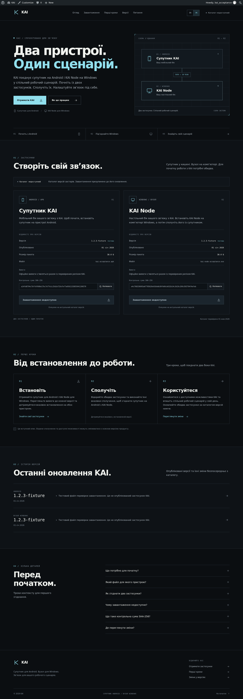

# KAI WordPress Portal — Preview

Public screenshot-only preview of the accepted KAI WordPress Portal 1.0.0 build.

## Main views

### English desktop

### Ukrainian desktop

### Ukrainian mobile

## Full portal

### English desktop

### Ukrainian desktop

### English 390 px

### Ukrainian 390 px

## Backend states

### Backend unavailable — Ukrainian

### Backend stale — Ukrainian

---

This repository intentionally contains screenshots only. No private credentials, production backend configuration, or unpublished KAI source code are included.

## Target style correction reference

Visual correction reference for the next Factory pass:

- [Home — desktop](style-reference/screenshots/home-desktop.png)
- [Downloads — desktop](style-reference/screenshots/downloads-desktop.png)
- [Documentation — desktop](style-reference/screenshots/docs-desktop.png)
- [Home — mobile](style-reference/screenshots/home-mobile.png)
- [Style direction for Factory](style-reference/STYLE_DIRECTION.md)

This is a visual target/reference, not a replacement implementation.
